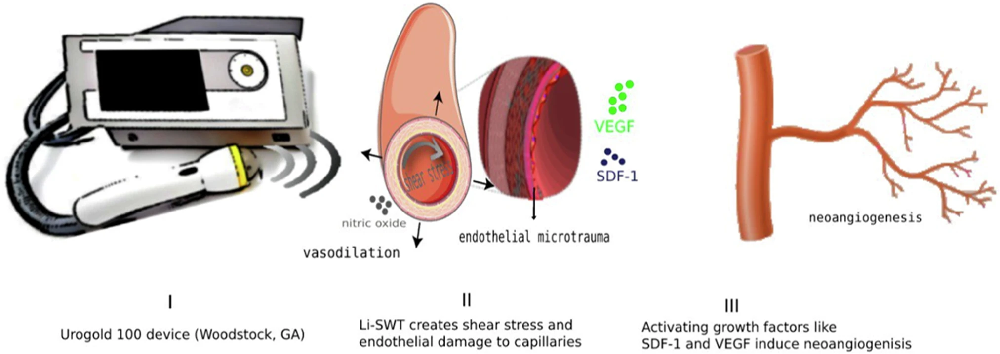

---

<em>"Fig. 1" from the article (reference "1" below)</em>

---

A new article has been published in the [International Journal of Impotence Research](https://www.nature.com/ijir/) titled "[Successful treatment of hard flaccid syndrome with multimodal therapy: a case report study](https://doi.org/10.1038/s41443-024-00955-x)."

The article presents a case study of using low-intensity shock wave therapy (LiSWT) to manage Hard Flaccid Syndrome (HFS) in a 36-year-old male. The patient was treated with a combination of LiSWT, phosphodiesterase type 5 inhibitors (PDE5-I), and physical therapy. After six sessions, the patient showed significant symptom regression and improved erections. A two-year follow-up confirmed sustained relief. LiSWT, inducing neovascularization, showed promise as a non-invasive HFS treatment.[[1]](https://doi.org/10.1038/s41443-024-00955-x)

While the patient in the article reportedly experienced symptom relief with the aforementioned treatment options, namely LiSWT, the majority of HFS cases that pursue said treatment options generally do not achieve significant results. This highlights the need for further systematic research to validate the efficacy of these therapies for HFS.

#### References

1. Yazar, R. O., Hammad, M. A., Barham, D. W., Azad, B., & Yafi, F. A. (2024). [Successful treatment of HARD FLACCID syndrome with multimodal therapy: A case report study](https://doi.org/10.1038/s41443-024-00955-x). International Journal of Impotence Research.

